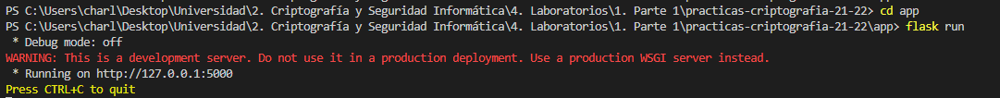

# Lanzando el servidor

1. Tener instalados los requirements
2. Acceder a la carpeta app: *cd app*
3. Lanzar el sevidor web: *flask run* o *python app.py*

# Planteamiento y datos de interés

- Tenemos 1 usario que accede con su token que ha recibido por correo al banco
- Una vez comprobado su token con el hash de la DB, accederá a una página para las transacciones
- Ahí el usuario envia un mensaje diciendo la cantidad de dinero que mete en el banco
- El banco recibe el mensaje encriptado simetricamente y  **asumiendo que ambo poseen la clave**, lo desencripta
- Despues, el banco envía un mensaje automatico al usuario confirmando la transacción
- Asumimos que el usuario ya está registrado en la DB y ya tiene su token guardado con el hash correspondiente
- Elegimos hash de 256 ya que aunque sea más lento al tratarse de un banco, prima mas la seguridad del dinero que la rapidez de comunicación
- Para la prueba usaremos, entre otros:

  - Usuario 1:

    - Token: **1822312231**
    - Token con hash 256: **e770708a8b682abd84de7851950e00479563c4edb57c2af0e77001b28c49887f**
  - Usuario 2:

    - Token: **5829919431**
    - Token con hash 256: **41da787004e0e2adc3a9499deb8c90ddbbb5e487a115dad827582e01ca3cf812**
  - Usuario 3:

    - Token: **1855512531**
    - Token con hash 256: **524aaddf27ebcebd61de1ebb699f20fd2a6ce161c53fc1529bfbba2bd868f0b9**
  - Usuario 4:

    - Token: **1822311231**
    - Token con hash 256: **d0e448d6a6fe6b4ba5783258b73c349bef455e0d2877a05a182f5d408df8f643**

Notas:
Para crear el archivo de requisitos, use: *pip freeze > requirements.txt*
Para instalar dichos requierements, use: *pip install -r requirements.txt* SINO NO FUNCIONA

Para crear el entorno virtual (NO NECESARIO):
*python -m venv venv*

Para acceder al entorno virtual, estando dentro de la carpeta backend en el terminal, use:
*venv\Scripts\activate*

Para ejecutar flask: *flask run o python app.py*

Código para hacer push si no se detecta el remoto: git push origin HEAD:master
